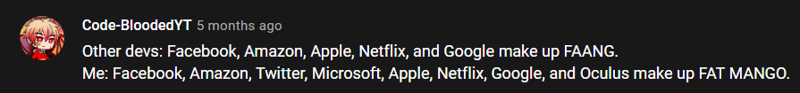

# FAT MANGO Preparation

This repo contains all my coding preparation to get into **FAT MANGO** industries and the *most important thing*, **Learn a lot to Improve my programming skills to be able to Change the World**.

> Note*: FAT MANGO -> Facebook, Amazon, Twitter, Microsoft, Apple, Netflix, Google, and Oracle.

## Contest Problems

These are some of the places where I solve problems, each one has a folder and
subfolders for different programming languages and different approaches.

```bash
├── CodeForces
├── FacebookCarrers
├── GitHubAssets
└── LeetCode
└── RandomCodes
```

## Name idea

The name idea was inspired by:

